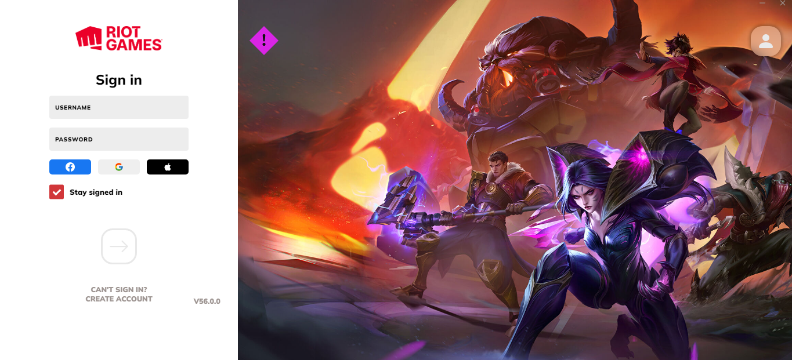
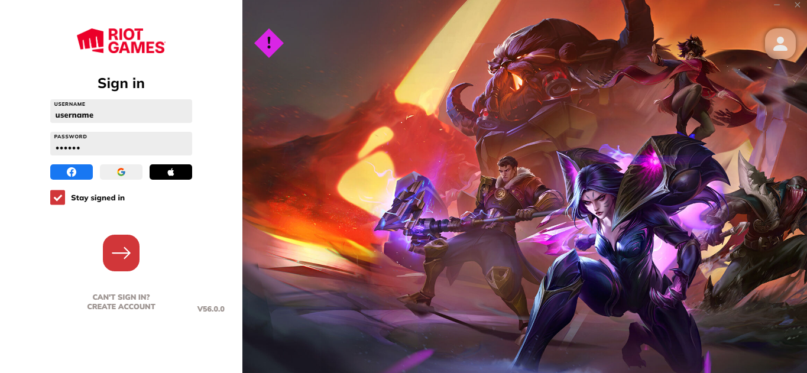

# League Client

## ✉ About

A clone of the League of Legends game client, made using modern web technologies.

## 🌆 Images




## ⚠ Requirements

In order to run the project, you will need:

- Node
- A web browser (Chrome, Firefox, Edge, etc...)

## 💻 Technologies Used

### FRONTEND

- HTML
- CSS
- JavaScript
- ReactJS
- Typescript

### EDITOR

- Visual Studio Code

## ⬇ How to download the project

```bash

git clone https://github.com/arthur-lage/league-client.git

cd league-client

npm install

npm run dev

```

## 🔗 How to use the app

If you wish to test the application, click the link below:

[League Client](https://league-client-al.vercel.com)